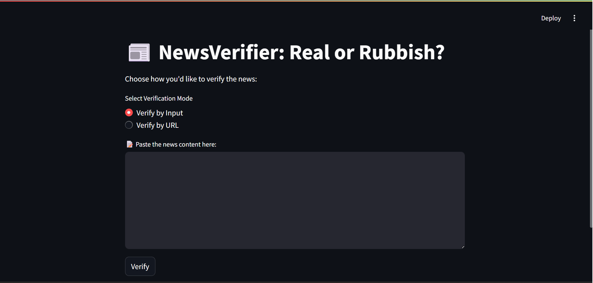
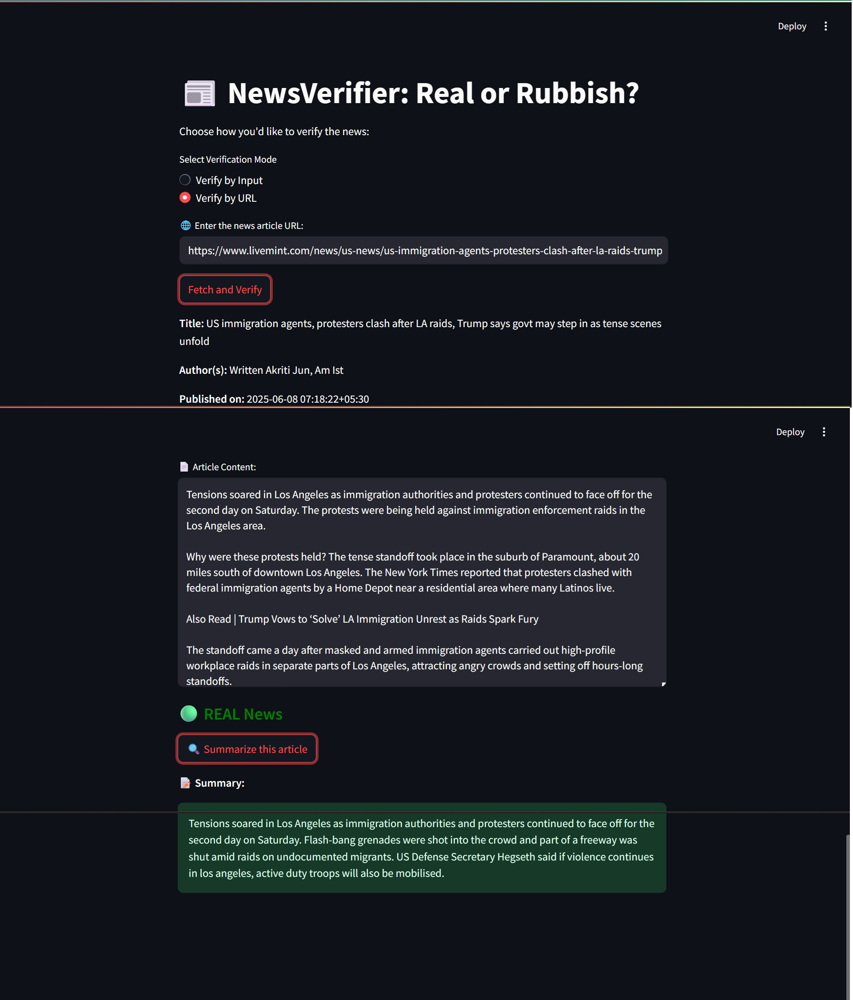
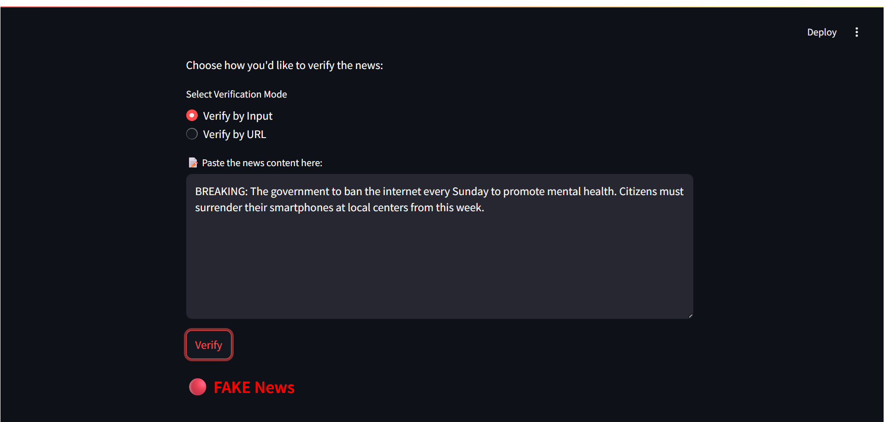

<!DOCTYPE html>
<html lang="en">
<head>
  <meta charset="UTF-8">
</head>
<body>

  

    <h1>📰 NewsVerifier – Real or Rubbish?</h1>
    
<strong>NewsVerifier</strong> is an intelligent web application built using <code>Streamlit</code> that detects whether a news article is REAL or FAKE. It also provides a summarization feature for real news and supports both manual input and URL-based verification.

  

  

    <h2>▶️ Launch App 🚀</h2>
    
Link : https://newsverifier-subhadeep.streamlit.app/

  

  

    <h2>🚀 Features</h2>
    <ul>
      <li>🧠 ML-powered Fake News Detection (Logistic Regression)</li>
      <li>🌐 Verify via <strong>URL</strong> or <strong>Manual Text</strong> Input</li>
      <li>🔍 <strong>Text Summarizer</strong> using NLTK for REAL news</li>
      <li>📁 Logs all predictions with timestamps and source</li>
      <li>📊 Displays performance metrics for predictions and summaries</li>
      <li>✅ Clean and interactive UI with error handling</li>
    </ul>
  

  

    <h2>📁 Project Structure</h2>
    <pre>
NewsVerifier/
├── app.py
├── model/
│   ├── fake_news_model.pkl
│   └── vectorizer.pkl
├── utils/
│   └── news_utils.py
├── fake_news_dataset.csv
├── train_model.py
├── requirement.txt      
└── README.md
    </pre>
  

  

    <h2>📦 Installation</h2>
    <ol>
      <li>Clone this repository</li>
      <li>Create a virtual environment: <code>python -m venv venv</code></li>
      <li>Activate it:
        <ul>
          <li><code>venv\Scripts\activate</code> (Windows)</li>
          <li><code>source venv/bin/activate</code> (Linux/macOS)</li>
        </ul>
      </li>
      <li>Install dependencies:
        <pre><code>
pip install -r requirements.txt
        </code></pre>
      </li>
    </ol>
  

   

    <h2>▶️ Prepare Dataset</h2>
    <pre>
Run prepare_data.py
    </pre>
    
This will merge True.csv and False.csv and keep the dataset ready for prediction.

  

  

    <h2>▶️ How to Run</h2>
    <pre>
streamlit run app.py
    </pre>
    
This will open a web browser with your app running locally.

  

  

    <h2>📘 Dataset</h2>
    
The model is trained on a labeled fake news dataset with "real" and "fake" labels. During training, 'real' is mapped to 1 and 'fake' to 0.

  

  

    <h2>🧠 Summarizer</h2>
    
Summarization is only available for news predicted as REAL. It uses NLTK's sentence tokenizer to generate a condensed version of the article in ~10 lines.

  

  

    <h2>🧠 Machine Learning Model</h2>
  <ul>
    <li>Binary classification model (Real = 1, Fake = 0)</li>
    <li>Trained on a labeled fake news dataset</li>
    <li>TF-IDF Vectorization for text representation</li>
    <li>Pickled model and vectorizer for deployment</li>
  </ul>
  

   

    <h2>📦 Required Libraries</h2>
  <pre><code>
streamlit
scikit-learn
pandas
numpy
nltk
newspaper3k
lxml
sumy
</code></pre>
  

  

    <h2>🖼️ Screenshots</h2>
  <h3>🔹 Home Page</h3>

<h3>🔹 Real News</h3>

<h3>🔹 Fake News</h3>

  

  

    <h2>👨‍💻 Developer</h2>
    
Project by Subhadeep Ghosh. 
    For contributions or issues, feel free to contact.

  

  

    <h2>📌 Disclaimer</h2>
    

      This project is developed solely for educational and research purposes.
      It is not intended for production use or to serve as a definitive fact-checking tool.
      The predictions made by the model may not always be accurate, and users are encouraged to verify news from official and reliable sources only.
    

  

</body>
</html>
